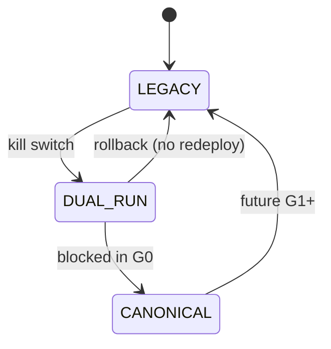

# 80 — Rollback and Operations (G0)

Rollback is designed before any future canonical pilot.

## Control

`CutoverControlService` / `POST .../control/{cohortId}` accepts `LEGACY` | `DUAL_RUN` only. `CANONICAL` → 400.

Audit every change in `ci_cutover_control.audit`.

## Observability

`CutoverObservability` counters (no PII): dual-run counts, quarantine hits, DI rate, control changes.

## Demo URL

`DemoFallbackQuarantine.assertNoDemoRedirect` — assistive/cutover paths must not use `DEMO_AI_LOS_URL`. Legacy `AiLosIntegrationService` deep-link left intact for deferred retirement.
