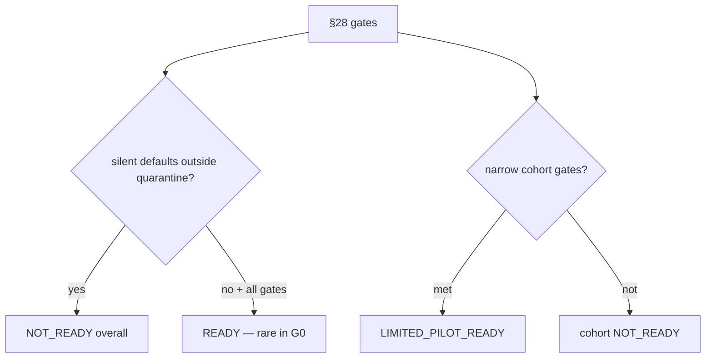

# 81 — G0 Validation Report

## Status

G0 Production Cutover Readiness **implemented**. Flags default **false**. Production underwriting **unchanged**. Overall readiness typically **NOT_READY**. A candidate cohort may reach **LIMITED_PILOT_READY** only when quarantine + certifications satisfy gates in test/config.

## Migrations

- **V106** — cutover tables + binding certification extension + seed inventory + DIGILEAP candidate cohort (`VALIDATION`)

## Completion checklist

| # | Criterion | Status |
|---|-----------|--------|
| 1 | Legacy defaults inventoried | Yes — catalog + V106 seed |
| 2 | Unsafe defaults mapped | Yes — canonical paths + missing behavior |
| 3 | Quarantine for cohorts | Yes — opt-in flags |
| 4 | Binding certification | Yes |
| 5 | Dual-run persist/review | Yes |
| 6 | Candidate cohort | Yes — `G0_CANDIDATE_COHORT_V1` |
| 7 | Dimension readiness | Yes — hybrid matrix |
| 8 | Stored/provider fixtures scanned | Yes — honest ORIGIN.md classification |
| 9 | Default impact quantified | Yes — from available dual-run rows only |
| 10 | Root-cause classes | Yes |
| 11 | Policy/decision certification | Yes |
| 12 | Rollback/kill switch | Yes — LEGACY↔DUAL_RUN |
| 13 | Observability | Yes — counters |
| 14 | No CANONICAL activation | Yes |
| 15 | Production unchanged | Yes |
| 16 | Tests | `CutoverG0Test` §42 |

## Dual-run statistics honesty

Computed only from fixture/dev `CiCutoverComparison` rows. No fabricated match rates. C6 bundles classified **REPRESENTATIVE_FIXTURE**. Provider fixtures under `provider-fixtures/**/ORIGIN.md` scanned; labels include USER_SUPPLIED_SAMPLE → representative, SYNTHETIC, and any STORED_PROVIDER/REAL_DEV if present.

## G1

Controlled production pilot **may not begin** until overall gates clear (silent defaults eliminated/quarantined platform-wide, real-data evidence, READY or approved LIMITED_PILOT with ops sign-off). G0 does not authorize G1 by itself.
