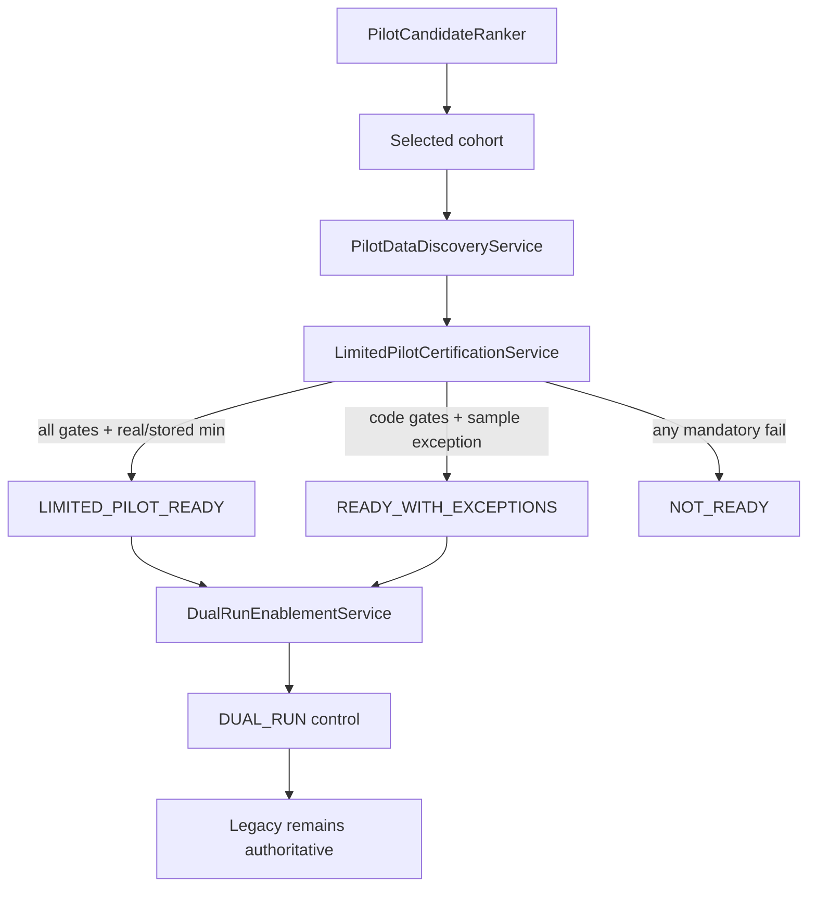

# 82 — Pilot Certification Architecture (G0.1)

G0.1 certifies whether one narrow cohort may enter **DUAL_RUN** while production authority remains **LEGACY**. CANONICAL authority stays locked (`allow-canonical-authority: false`).

## Status honesty

| Status | Meaning |
|--------|---------|
| `NOT_READY` | Mandatory gate failed **or** real/stored sample below minimum without exception |
| `READY_WITH_EXCEPTIONS` | Code gates pass; audited sample-size exception only — **not** LIMITED_PILOT_READY |
| `LIMITED_PILOT_READY` | All §34 gates including `min-real-or-stored-cases` |
| `REVOKED` | Previously granted certification withdrawn |

AI-Underwriter availability **never** affects the certification score.
