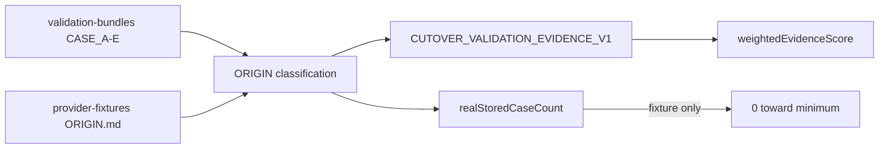

# 83 — Real-Data Validation (G0.1)

## Weights (validation-strength only)

| Origin | Weight |
|--------|--------|
| ANONYMIZED_REAL_DEV_DATA / REAL_DEV | 1.00 |
| STORED_PROVIDER_FIXTURE / STORED_PROVIDER | 0.90 |
| USER_SUPPLIED_SAMPLE | 0.60 |
| REPRESENTATIVE_PROVIDER_FIXTURE | 0.40 |
| SYNTHETIC | 0.20 |

Representative/synthetic fixtures **do not** count toward `cutover.min-real-or-stored-cases` (default 20).

## Current repo honesty

With present classpath evidence: **realStoredCaseCount = 0**. No fabricated applications.
