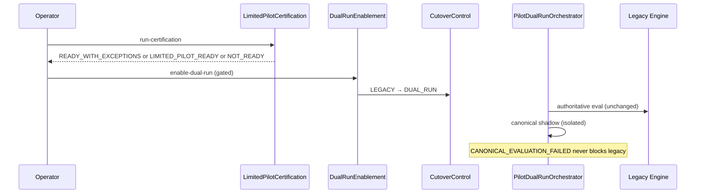

# 84 — Pilot Dual-Run (G0.1)

```mermaid
sequenceDiagram
  participant Ops as Operator
  participant Cert as LimitedPilotCertification
  participant En as DualRunEnablement
  participant Ctrl as CutoverControl
  participant Orch as PilotDualRunOrchestrator
  participant Leg as Legacy Engine
  Ops->>Cert: run-certification
  Cert-->>Ops: READY_WITH_EXCEPTIONS or LIMITED_PILOT_READY or NOT_READY
  Ops->>En: enable-dual-run (gated)
  En->>Ctrl: LEGACY → DUAL_RUN
  Orch->>Leg: authoritative eval (unchanged)
  Orch->>Orch: canonical shadow (isolated)
  Note over Orch: CANONICAL_EVALUATION_FAILED never blocks legacy
```

C6 CASE_A–E are executed as **REPRESENTATIVE_FIXTURE** applications for dual-run sampling. They are labeled honestly and excluded from the real/stored minimum.
