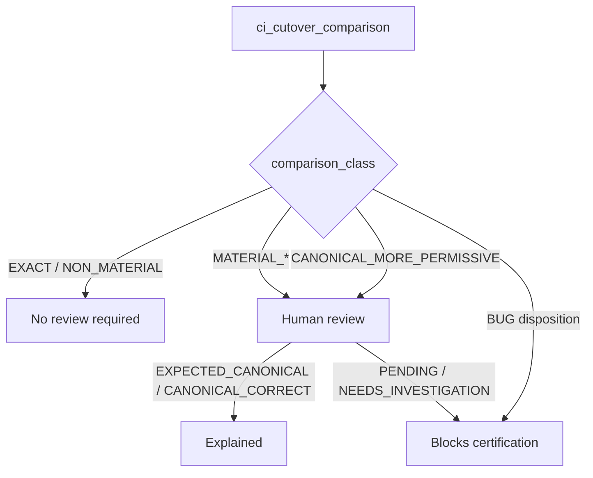

# 85 — Cutover Mismatch Review (G0.1)

## Thresholds (validation)

- unexplained material mismatch = **0**
- BUG-classified mismatch = **0**
- unexplained canonical-more-permissive = **0**
- replay mismatch = **0**
- critical binding failure = **0**

Canonical stricter after silent-default removal may be intentional when reviewed.
