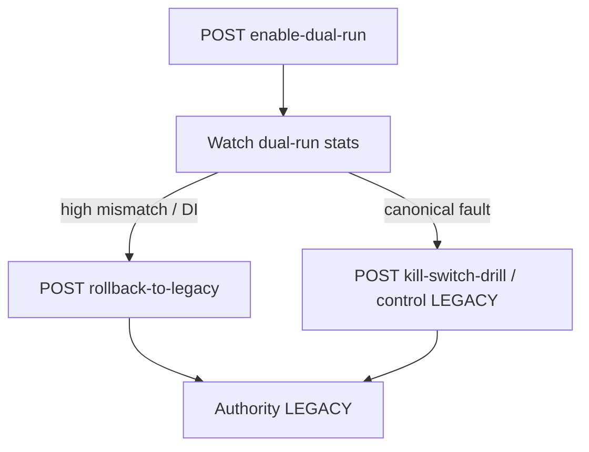

# 86 — Cutover Operations Runbook (G0.1)

## Procedures

1. **Enable dual-run** — only after certification `LIMITED_PILOT_READY` or `READY_WITH_EXCEPTIONS` with approved sample-size exception.
2. **Monitor** — dual-run volume, DI rate, material mismatch, canonical failure rate (no PII).
3. **Review mismatch** — disposition via comparison review API.
4. **Pause / rollback** — `POST /cohorts/{id}/rollback-to-legacy` (DUAL_RUN→LEGACY, no redeploy).
5. **Kill switch** — same control path; proves no application loss / no production interruption.
6. **Provider outage / engine failure** — isolate as `CANONICAL_EVALUATION_FAILED`; legacy continues.
7. **High DI / mismatch** — rollback, open data-gaps, escalate to credit-policy + platform ops.

## Escalation roles

| Role | Responsibility |
|------|----------------|
| Platform ops | Dual-run enable / kill switch |
| Credit policy | Mismatch disposition, exceptions |
| Risk approver | Sample-size exception (`ci_cutover_exception`) |

**Never** set `AuthorityMode.CANONICAL` in G0.1.
