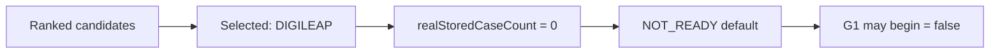

# 87 — G0.1 Certification Report

## Summary

G0.1 Limited Pilot Certification **implemented**. Production authority remains **LEGACY**. `allow-canonical-authority` remains **false**.

## Expected certification with current fixture-only evidence

| Field | Value |
|-------|-------|
| Selected candidate | **DIGILEAP** (highest objective score among DIGILEAP / SCF_STARTER / REBOOST / SMART_SWITCH) |
| realStoredCaseCount | **0** |
| LIMITED_PILOT_READY | **false** |
| Default status | **NOT_READY** (sample below min=20) |
| READY_WITH_EXCEPTIONS | Only when audited sample-size exception granted in test/ops |
| G1 controlled pilot may begin | **false** |

## Gates covered

Critical bindings, default leakage assert, replay 100%, mismatch thresholds, ambiguity gate, dual-run isolation, quarantine zero-leakage path, rollback + kill-switch drills, tenant isolation, CANONICAL rejection, AI offline irrelevant.

## Migration

`V107__credit_intelligence_cutover_g0_1.sql` — certification, data gaps, operational events, drills, exceptions, candidate scores.
