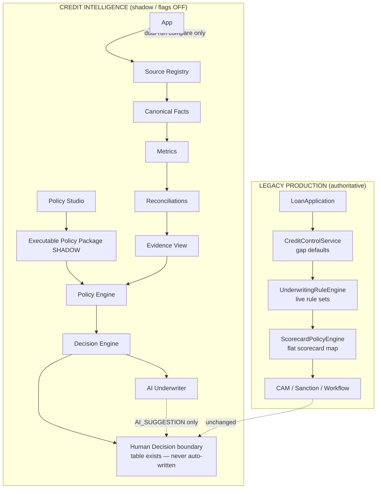

# 01 — What We Have Built (F → A1 / G0.1)

**Audience:** CEO / Credit Head  
**Mode:** Read-only product & architecture walkthrough  
**Authority today:** Legacy underwriting remains production-authoritative. Credit Intelligence is shadow / authoring / assistive only.

---

## Architecture actually implemented

---

## Layer inventory

| Layer | Package / key services | Primary tables | Mode | Flag(s) |
|-------|------------------------|----------------|------|---------|
| Application (LOS) | `LoanApplicationFlowService` | loan / underwriting meta | **Production** | n/a |
| Source Registry | `creditintelligence` foundation / source registry | `ci_source_*` (V86+) | Shadow | `foundation`, `source-registry` |
| Canonical Facts | `bureau`, `gst`, `banking`, `tax` + snapshot builder | fact snapshots, family tables (V88–V95) | Shadow dual-write | `canonicalization.*.enabled` |
| Metrics | Family metric services + `ci_metric_definition` / results | metric result sets (V98) | Shadow | same + evaluation-context |
| Reconciliations | `reconciliation` | recon defs/results (V96–V97) | Shadow | `reconciliation.enabled` |
| Evidence | `CreditEvidenceViewBuilder` | validation runs (V99) | Shadow read model | `validation.enabled` |
| Evaluation purity | `EvaluationContextFactory`, config freeze, clock | `ci_evaluation_context`, `ci_config_freeze` (V98) | Shadow | `evaluation-context`, `config-freeze`, `frozen-policy-execution` |
| Policy Studio | `policystudio` | draft packages, sessions, ambiguities (V100–V102) | **Authoring only** | `policy-studio.enabled` |
| Policy Engine | `policy.ShadowPolicyEngine` | executable packages, evaluations (V103) | **Shadow** | `policy-engine.enabled` / `dsl-shadow-enabled` |
| Decision Engine | `decision.ShadowDecisionEngine` | recommendations (V104) | **Shadow** | `decision-engine.enabled` / `shadow-enabled` |
| AI Underwriter | `aiunderwriter` | suggestions, prompts (V105) | **Assistive** | `ai-underwriter.enabled` |
| Cutover / Pilot | `cutover` + `cutover.pilot` | cohorts, dual-run, certification (V106–V107) | Prep only | `cutover.enabled`; `allow-canonical-authority: false` |
| Human decision | `CiHumanCreditDecision` | table exists | **Handoff future** | never written by CI |

**All Credit Intelligence feature flags default to `false`.**

---

## Legacy production path (still what runs credit)

1. Application enters underwriting.  
2. `CreditControlService.resolveEffective` builds scorecard — **silent GAP / SCF_GAP / DEMO fallbacks** fill missing numbers.  
3. Live `UnderwritingRuleEngine` + `ScorecardPolicyEngine` decide.  
4. Limit sizing / CAM / sanction / workflow continue unchanged.  
5. Shadow CI may dual-run in parallel **only if flags enabled** — never overrides sanction.

---

## What “complete in shadow” means

| Claim | Meaning |
|-------|---------|
| Spine exists | Source → Fact → Metric → Recon → Policy → Decision → AI assist |
| Executable | Engines run in tests and internal APIs |
| Not production | No ACTIVE policy, no authoritative recommendation, no auto human decision |
| Cutover | G0.1 **NOT_READY** — `realStoredCaseCount = 0`, `LIMITED_PILOT_READY = false` |

---

## Flyway spine (V86–V107)

Foundation → bureau/GST/banking/tax → reconciliation → evaluation purity → validation/cutover assessor → Policy Studio → Policy Engine → Decision Engine → AI Underwriter → G0 cutover → G0.1 pilot certification.

---

## Packages under `com.los.core.creditintelligence`

`aiunderwriter`, `api`, `banking`, `bureau`, `config`, `core`, `cutover`, `decision`, `domain`, `evaluation`, `gst`, `policy`, `policystudio`, `provider`, `reconciliation`, `repository`, `service`, `support`, `tax`, `validation`
